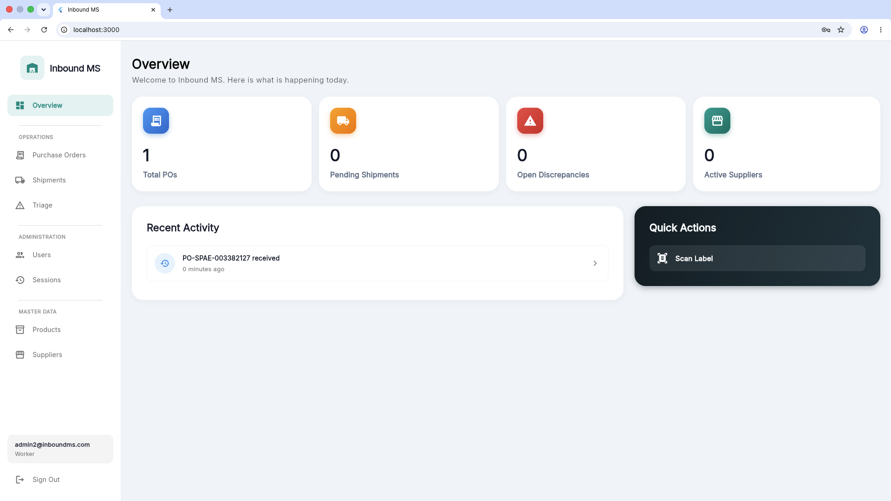
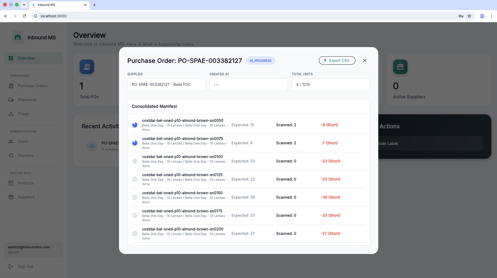
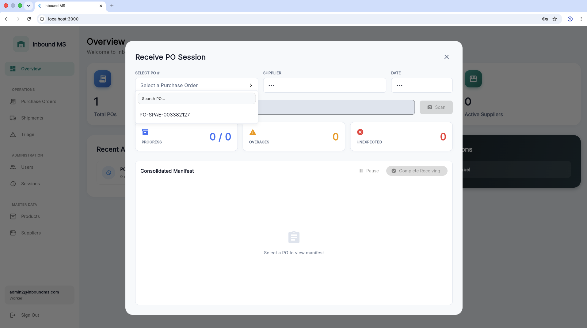
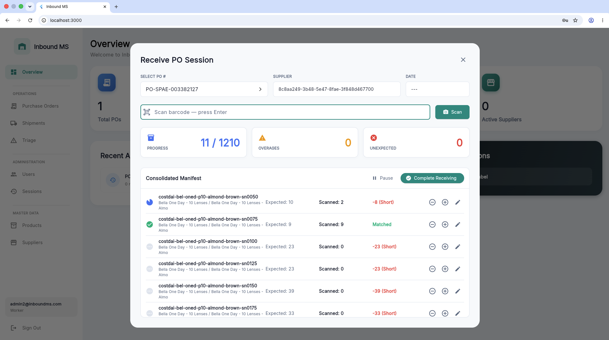
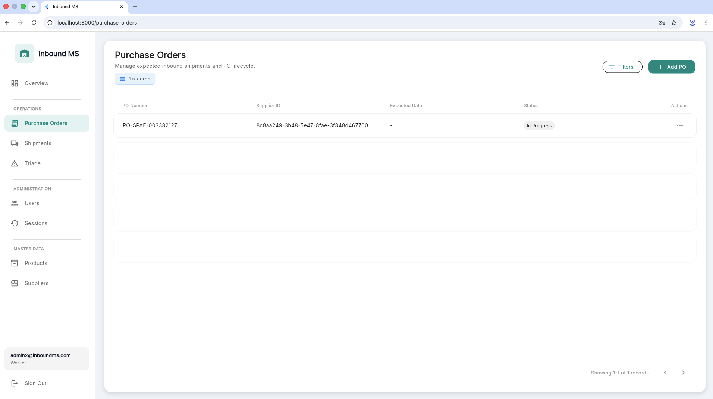
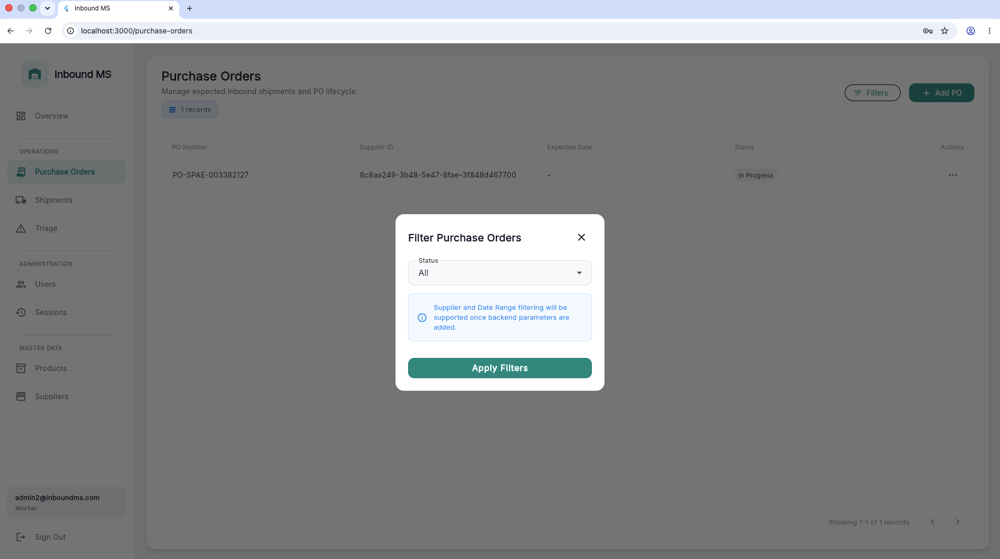
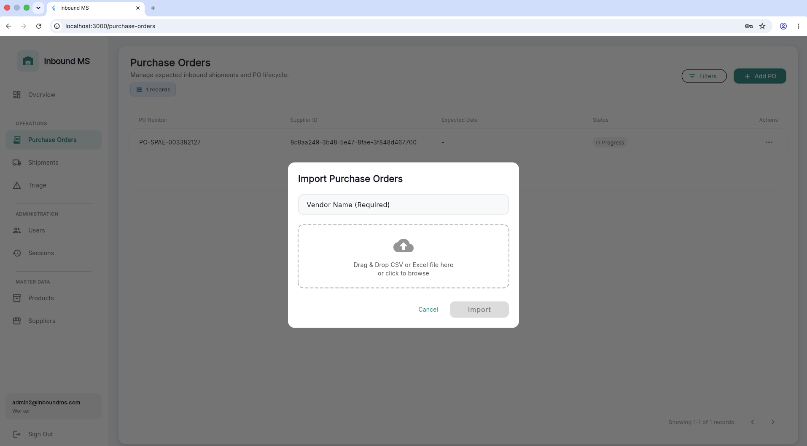
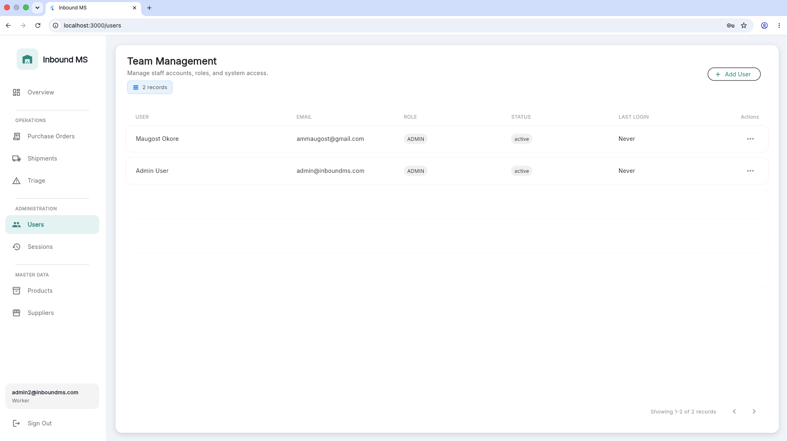

# Inbound MS (Inbound Management System)

Inbound MS is a robust, cross-platform Flutter application designed to streamline and modernize warehouse receiving operations. By digitizing Purchase Orders, automating inbound scans, and tracking discrepancies, it bridges the gap between procurement and warehousing.

## 📸 Screenshots

| Dashboard & Overview | Purchase Orders |
| :---: | :---: |
|  |  |
|  |  |

| Receiving & Scanning | Sessions |
| :---: | :---: |
|  |  |
|  |  |

## 📦 Features

### Authentication & Role Management
- **Role-based Access Control (RBAC):** Distinct workflows and access levels for Managers, Supervisors, and Workers.
- **Supabase Auth:** Secure email/password authentication.

### Purchase Order (PO) Management
- **Bulk Imports:** Quickly upload and parse Purchase Orders via CSV or Excel (XLSX) files.
- **Dynamic Filtering & Triage:** Filter POs by status (Pending, In Progress, Completed, Discrepant).
- **Vendor Enforcement:** Guaranteed data integrity with mandatory supplier mapping upon import.

### Receiving Operations
- **Session Management:** Start, resume, and track individual receiving sessions per worker.
- **Barcode Scanning Support:** Quickly increment received counts by scanning product barcodes or SKUs.
- **Blind Receiving:** Support for workflows where expected quantities are hidden from floor workers.
- **Discrepancy Engine:** Automatically highlight overages, shortages, and unexpected items.

## 🛠️ Technology Stack

- **Framework:** [Flutter](https://flutter.dev/) (Multi-platform)
- **Backend as a Service (BaaS):** [Supabase](https://supabase.com/) (PostgreSQL & Auth)
- **State Management:** [Provider](https://pub.dev/packages/provider)
- **Routing:** [Auto_Route](https://pub.dev/packages/auto_route)
- **Data Parsing:** `csv` & `excel` packages for heavy data ingestion.

## 🚀 Getting Started

### Prerequisites
- [Flutter SDK](https://docs.flutter.dev/get-started/install) (latest stable)
- A Supabase Project

### Database Setup

1. In your Supabase project dashboard, navigate to the **SQL Editor**.
2. Open the `supabase/schema.sql` file located in this repository.
3. Copy and execute the contents of `schema.sql` to provision all necessary tables, types, and Row Level Security (RLS) policies.

### Environment Setup

1. Clone the repository and navigate to the project directory:
   ```bash
   cd inbound_ms
   ```

2. Install dependencies:
   ```bash
   flutter pub get
   ```

3. Setup your environment variables:
   Create a `.dart_define.staging.json` (and optionally `.dart_define.production.json`) file in the root of your project:
   ```json
   {
     "SUPABASE_URL": "your_supabase_project_url",
     "SUPABASE_ANON_KEY": "your_supabase_anon_key"
   }
   ```
   *Note: VS Code run configurations (`launch.json`) are already set up to load these automatically using `--dart-define-from-file`.*

4. Code Generation (if modifying routes or models):
   ```bash
   dart run build_runner build -d
   ```

5. Run the application:
   ```bash
   flutter run
   ```

## 📂 Project Structure

The project follows a highly modular, feature-first architecture (`lib/features/`):
- `auth`: Sign in and role-based permissions.
- `dashboard`: Responsive sidebar and layout frame.
- `purchase_orders`: PO listing, CSV/Excel parsing, and status filtering.
- `receiving`: Active session handling, barcode scanning logic, and manifests.
- `core`: Shared API services, utilities, themes, and UI components (e.g., `AppButton`, `AppTableView`).

## 📜 License
This project is proprietary and intended for internal operations.
